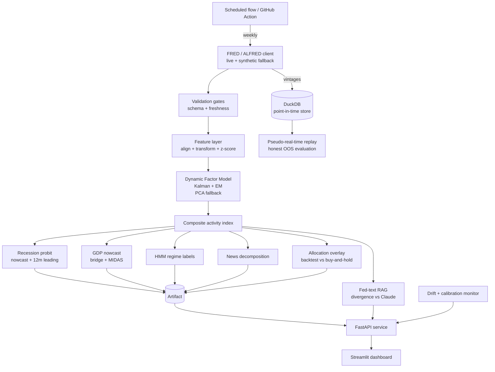

# Macro Nowcasting System

[](https://github.com/felariop-jpg/macro-nowcaster/actions/workflows/ci.yml)  ·  [**Live dashboard**](https://felaris-macro-nowcaster.streamlit.app)

A point-in-time, mixed-frequency macroeconomic nowcasting platform. It aggregates
30+ FRED indicators into a composite activity index using a dynamic factor model,
nowcasts GDP, tracks recession probability (coincident and 12-month-ahead), labels
the macro regime, cross-references the Federal Reserve's own language against the
quantitative signal, and serves all of it through a versioned API and a dashboard.

This is the production rebuild of a prototype notebook. The emphasis is on the
three things that separate elite quant work from a portfolio toy: it is **live**
(self-refreshing), **adversarially correct** (point-in-time, honestly out of
sample), and **tied to a decision** (a backtested asset-allocation overlay).

---

## Why this is not a standard portfolio project

1. **Point-in-time data integrity.** Every observation is stored with the date it
   became known. The historical nowcast is reconstructed from vintages and
   publication lags, so it never secretly uses revised or future data. This is the
   failure mode that quietly invalidates most macro and ML finance projects.
2. **Honest out-of-sample evaluation.** A pseudo-real-time replay regenerates the
   nowcast as it would have been produced each month and scores it against what
   actually happened. The in-sample recession AUC is near perfect; the honest
   out-of-sample AUC is materially lower, and the project reports the lower number.
3. **A proper state space model.** The composite is a mixed-frequency dynamic
   factor model (Kalman filter, EM) that handles ragged edges natively, not PCA on
   zero-filled data.
4. **News decomposition.** When a release lands, the system attributes how much the
   nowcast moved and to which indicator (a flow of incoming information, not a
   static snapshot).
5. **A decision, not a chart.** A macro-state allocation overlay translates the
   signal into an equity weight and is backtested net of costs against buy-and-hold.
6. **A Fed-text RAG layer.** Retrieval over FOMC statements and minutes plus a Claude
   call flags where the central bank's language diverges from the data.
7. **Production engineering.** Layered package, DuckDB point-in-time store, FastAPI
   service, Streamlit frontend, data-validation gates, drift and calibration
   monitoring, unit tests, CI, Docker, and a scheduled self-refresh.

---

## Architecture



Layout:

```
src/macro_nowcaster/
  config.py            settings + indicator universe from config/indicators.yaml
  data/                fred_client (live + ALFRED + synthetic), store (DuckDB PIT), validation
  features/            frequency align, transforms, point-in-time z-scores
  models/              dfm (Kalman), midas (GDP), recession (probit), regime (HMM), news
  backtest/            pseudo_realtime (honest OOS), allocation (overlay backtest)
  llm/                 fed_rag (RAG vs Fed text), memo_agent (research memo)
  monitoring/          drift (PSI), calibration
  pipeline.py          orchestration -> artifact
  api/main.py          FastAPI service
app/streamlit_app.py   frontend (consumes the API, or runs locally)
tests/                 unit tests for every core module
flows/                 scheduled refresh
```

---

## Quickstart

```bash
pip install -e ".[dev,app,llm]"

# 1. Build the artifact (uses synthetic data with no key; live data if FRED_API_KEY is set)
python -m macro_nowcaster.pipeline

# 2. Run the API
uvicorn macro_nowcaster.api.main:app --reload --port 8000

# 3. Run the dashboard against the API
MN_API_URL=http://localhost:8000 streamlit run app/streamlit_app.py

# Tests and lint
pytest -q
ruff check src tests

# Everything in containers
docker compose up --build
```

Set keys for live data and the LLM features:

```bash
export FRED_API_KEY=...        # https://fredaccount.stlouisfed.org/apikeys
export ANTHROPIC_API_KEY=...   # enables the Fed RAG analysis and written memos
```

With no keys the system runs fully on a deterministic synthetic business cycle, so
the whole thing is testable and demoable offline.

---

## What is real vs what needs a key

Honesty is part of the engineering here.

- **Fully working offline (synthetic data):** the entire pipeline, DFM, recession
  and GDP models, regimes, news decomposition, point-in-time replay, allocation
  backtest, monitoring, API, frontend, and the RAG retrieval step.
- **Needs `FRED_API_KEY`:** live and ALFRED-vintage data. The client uses real
  ALFRED vintages when available and falls back to a publication-lag proxy.
- **Needs `ANTHROPIC_API_KEY`:** the written Fed-divergence analysis and the
  research memo. Without it these return clean, structured stubs so nothing breaks.

---

## Known limitations (and the honest framing)

- The live snapshot standardizes over the full sample for interpretability; the
  pseudo-real-time backtest uses expanding-window standardization to stay honest.
- The replay uses PCA rather than the DFM for speed across hundreds of refits; this
  is a cost-versus-fidelity choice, not a correctness one.
- ISM/PMI surveys are excluded because FRED removed them for licensing reasons.
- The allocation overlay is a deliberately simple, transparent rule; it is a
  demonstration that the signal can drive a decision, not a tuned strategy.

See `METHODOLOGY.md` for the modelling detail and design rationale.
