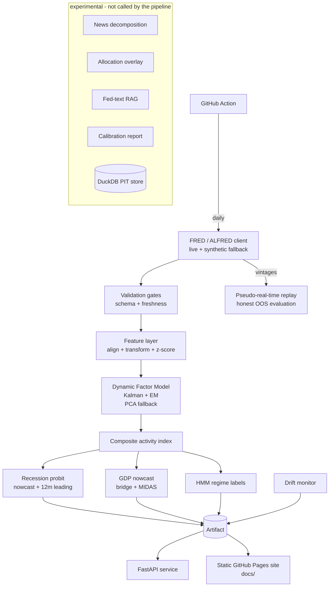

# Macro Nowcasting System

## [**Live dashboard -> felariop-jpg.github.io/macro-nowcaster**](https://felariop-jpg.github.io/macro-nowcaster/)

A static page served by GitHub Pages: the current-quarter GDP nowcast and recession
probability load instantly, with no server and no cold start. GitHub Actions re-runs
the whole model daily at 12:17 UTC against the latest FRED vintage and commits
the refreshed page.

[](https://github.com/felariop-jpg/macro-nowcaster/actions/workflows/ci.yml)
[](https://github.com/felariop-jpg/macro-nowcaster/actions/workflows/update.yml)  ·  [Streamlit version](https://felaris-macro-nowcaster.streamlit.app) (fuller dashboard, slower to wake)

A point-in-time macroeconomic nowcasting platform over a mixed-frequency panel. It aggregates
30 FRED indicators into a composite activity index using a dynamic factor model,
nowcasts GDP, tracks recession probability (coincident and 12-month-ahead), labels
the macro regime, and serves all of it through a versioned API and a static
dashboard rebuilt daily. (A Fed-text retrieval layer exists in the repo but is not
wired into the pipeline - see Experimental modules below.)

This is the production rebuild of a prototype notebook. The emphasis is on the
two things that separate serious macro work from a portfolio toy: it is **live**
(self-refreshing) and **adversarially correct** (point-in-time vintages, honestly
out of sample, with the weaker number reported).

---

## Why this is not a standard portfolio project

1. **Point-in-time data integrity.** Every observation is stored with the date it
   became known. The historical nowcast is reconstructed from vintages and
   publication lags, so it never secretly uses revised or future data. This is the
   failure mode that quietly invalidates most macro and ML finance projects.
2. **Honest out-of-sample evaluation.** A pseudo-real-time replay regenerates the
   nowcast as it would have been produced each month and scores it against what
   actually happened. The in-sample recession AUC is near perfect; the honest
   out-of-sample AUC is materially lower, and the project reports the lower number.
3. **A proper state space model.** The composite is a dynamic factor model
   (Kalman filter, EM) that handles the ragged edge natively rather than PCA on
   zero-filled data. Daily and weekly series are averaged to month-end before
   estimation, so the state space itself is monthly: "mixed frequency" here means
   the inputs arrive at different frequencies and on a ragged edge, not that
   quarterly series sit inside the model the way `DynamicFactorMQ` allows.
4. **Production engineering.** Layered package, FastAPI service, data-validation
   gates, drift monitoring, unit tests, CI, Docker, and a scheduled self-refresh
   that publishes the static site.

---

## Experimental modules (not wired into the pipeline)

These are implemented and unit-tested, but **nothing in the live pipeline, the API
or the published site calls them**, and they produce no output you can see on the
dashboard. They are here as working sketches, not as system capabilities. The code
stays in the repo; the claims do not.

| Module | State |
|--------|-------|
| `models/regime.py:news_decomposition` | Attributes a nowcast revision to the cells that changed, by leave-one-out refitting. Never called outside tests, so no release attribution is published. It is also not the Kalman-filter news equation the DFM would support. |
| `backtest/allocation.py` | Maps the macro state to an equity weight and backtests it net of costs. Exercised only on random returns in a unit test: no equity series is configured and no backtest result exists in this repo. |
| `llm/fed_rag.py` | TF-IDF retrieval over Fed text plus a Claude call. There is no corpus and no fetcher, so it has never run against real FOMC documents. |
| `monitoring/drift.py:calibration_report` | Reliability table for the recession probabilities. Implemented, never called. |
| `data/store.py:PointInTimeStore` | DuckDB vintage store. The pipeline and the replay both read vintages straight from the ALFRED client instead, so this sits outside the data path. |

---

## Architecture


```mermaid
flowchart TD
    A[FRED / ALFRED client<br/>live + synthetic fallback] --> V[Validation gates<br/>schema + freshness]
    V --> F[Feature layer<br/>align + transform + z-score]
    F --> D[Dynamic Factor Model<br/>Kalman + EM<br/>PCA fallback]
    D --> C[Composite activity index]
    C --> R[Recession probit<br/>nowcast + 12m leading]
    C --> G[GDP nowcast<br/>bridge + MIDAS]
    C --> H[HMM regime labels]
    A -->|vintages| PR[Pseudo-real-time replay<br/>honest OOS evaluation]
    R & G & H --> ART[(Artifact)]
    ART --> API[FastAPI service]
    ART --> SITE[Static GitHub Pages site<br/>docs/]
    MON[Drift monitor] --> ART
    SCHED[GitHub Action] -->|daily| A
    subgraph EXP [experimental - not called by the pipeline]
      N[News decomposition]
      AL[Allocation overlay]
      RAG[Fed-text RAG]
      CAL[Calibration report]
      DB[(DuckDB PIT store)]
    end
```

Layout:

```
src/macro_nowcaster/
  config.py            settings + indicator universe from config/indicators.yaml
  data/                fred_client (live + ALFRED + synthetic), store (DuckDB PIT), validation
  features/            frequency align, transforms, point-in-time z-scores
  models/              dfm (Kalman), midas (GDP), recession (probit), regime (HMM + news)
  backtest/            pseudo_realtime (honest OOS); allocation (experimental)
  llm/                 memo_agent (research memo); fed_rag (experimental, no corpus)
  monitoring/          drift (PSI); calibration (experimental, never called)
  pipeline.py          orchestration -> artifact
  api/main.py          FastAPI service
generate_report.py     builds the static site -> docs/ (what GitHub Pages serves)
docs/                  index.html + latest.json + chart HTML, published by Pages
app/streamlit_app.py   Streamlit frontend (consumes the API, or runs locally)
tests/                 unit tests for every core module
flows/                 scheduled refresh
```

---

## Quickstart

```bash
pip install -e ".[dev,app,llm]"

# 1. Build the artifact (uses synthetic data with no key; live data if FRED_API_KEY is set)
python -m macro_nowcaster.pipeline

# 2. Run the API
uvicorn macro_nowcaster.api.main:app --reload --port 8000

# 3. Run the dashboard against the API
MN_API_URL=http://localhost:8000 streamlit run app/streamlit_app.py

# 4. Rebuild the static Pages site into docs/ (what the live demo serves)
python generate_report.py
open docs/index.html

# Tests and lint
pytest -q
ruff check src tests

# Everything in containers
docker compose up --build
```

Set keys for live data and the LLM features:

```bash
export FRED_API_KEY=...        # https://fredaccount.stlouisfed.org/apikeys
export ANTHROPIC_API_KEY=...   # enables the Fed RAG analysis and written memos
```

With no keys the system runs fully on a deterministic synthetic business cycle, so
the whole thing is testable and demoable offline.

---

## What is real vs what needs a key

Honesty is part of the engineering here.

- **Fully working offline (synthetic data):** the entire live pipeline - DFM,
  recession and GDP models, regimes, point-in-time replay, drift monitoring, API,
  and the static site build. The experimental modules listed above also run, but
  only from their unit tests.
- **Needs `FRED_API_KEY`:** live and ALFRED-vintage data. The client uses real
  ALFRED vintages when available and falls back to a publication-lag proxy.
- **Needs `ANTHROPIC_API_KEY`:** the written Fed-divergence analysis and the
  research memo. Without it these return clean, structured stubs so nothing breaks.

---

## How the live page stays live

`generate_report.py` runs the whole pipeline end to end - current FRED vintage,
dynamic factor model, recession probits, GDP nowcast - and writes plain static
files into `docs/`:

| File | Contents |
|------|----------|
| `docs/latest.json` | `gdp_nowcast`, `recession_prob`, the UTC `updated` stamp, benchmarks and backtest stats |
| `docs/chart_*.html` | interactive Plotly charts (plotly.js from a CDN, so the files stay small) |
| `docs/index.html` | single-file landing page that fetches `latest.json` and embeds the charts |

`.github/workflows/update.yml` runs it daily at 12:17 UTC (and on demand via
*Run workflow*), reads the FRED key from the `FRED_API_KEY` repository secret, and
commits `docs/` only when something changed. Nothing is rendered at visit time, so
the page is as fast as a static file - because it is one.

`app/snapshot.json` is a frozen artifact of the retired Streamlit app: nothing
auto-refreshes it any more, so treat its numbers as stale. `scripts/export_snapshot.py`
still regenerates it by hand if you ever want it current.

---

## Known limitations (and the honest framing)

- The live snapshot standardizes over the full sample for interpretability; the
  pseudo-real-time backtest uses expanding-window standardization to stay honest.
  This means the charts on the site are full-sample re-estimates, **not** a
  real-time track record - the point-in-time claim belongs to the backtest.
- **The GDP nowcast has no out-of-sample evaluation yet.** The backtest scores the
  composite and the recession probability only, and the ± band on the GDP figure is
  the regression's in-sample residual standard error, not a calibrated interval.
- The replay window contains three recessions (2001, 2008-09, 2020), so the
  out-of-sample AUC carries a wide confidence interval regardless of its decimals.
- The replay uses PCA rather than the DFM for speed across hundreds of refits; this
  is a cost-versus-fidelity choice, not a correctness one.
- ISM/PMI surveys are excluded because FRED removed them for licensing reasons.
- The allocation overlay is a deliberately simple, transparent rule; it is a
  demonstration that the signal can drive a decision, not a tuned strategy.

See `METHODOLOGY.md` for the modelling detail and design rationale.
